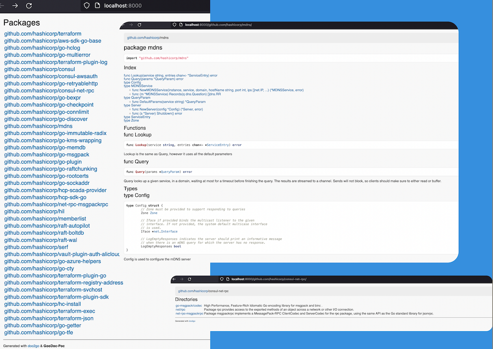

# GooDoc-PoC: `G`olang `o`wn `o`rganization `Doc`umentation (🤯) 

**NOTE**: this is simple bloody  **PoC** (!) to generate a static documentation for golang packages stored in `Github` organization.

## Rationale

[pkgsite](https://pkg.go.dev/golang.org/x/pkgsite) could be too powerful for some use cases. [doc2go](https://github.com/abhinav/doc2go) could be a choice though:

- assumes golang dependency on the target machine (to retrieve all dependencies via `go get`)
- requires manual adjustments (including manual main `index.html` merge) when documentation for unrelated packages is generated one by one  

## Idea

A glue code for `go2doc` which:

- clones a target package and retrieves all its dependencies (no `go` dependency)
- runs for target packages and theirs dependencies and produces an index file

### Requirements

- `yq`: to be downloaded by the PoC if missing)
- `doc2go`: is expected to be already available in `$PATH`

### Usage

1. Adjust `config.yml`
2. Ensure `www-root-dir` from config is created/existent
3. Run `./godoc.sh` to generate documentation accordingly to the config
4. Run webserver against `www-root-dir` to see the documentation

Given that the repo has been cloned as is, `make smoke-test` should perform the steps above for you.

Default [config.yml](config.yml) targets against certain awesome Hashicorp masterpieces.

### Algorithm

- `git clone` packages listed in the config. The corresponding dependencies (using entries from `go.sum`) are retrieved in DFS way as well. If some packages are already available locally, they are `git pull`ed. Done mostly in [gomod-deps helper](gomod-deps-helper.sh).
- `doc2go` is applied against the each package cloned. All references to packages from the same Github organization are preserved (instead of using default `pkg.go.dev` URL)
- Single main `index.html` for all packages processed is produced

## Disclaimer

Since this is proof of concept only, more likely there is no further maintainenace is assumed: you use it on your own risk & responsibility.
And usage of shell scripting for this PoC wasn't the best idea ever 😃 but efforts consuming.
